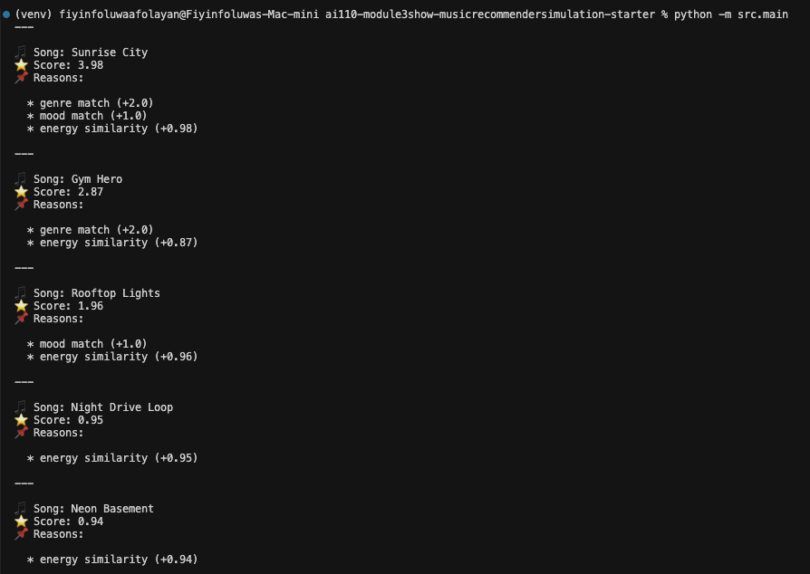
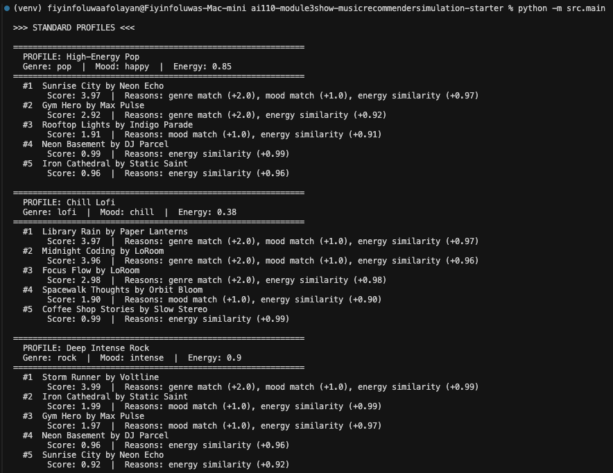

# VibeMatch AI

VibeMatch AI is a local full-stack version of the original Python music
recommender simulation. The project is now split into a Next.js frontend and a
FastAPI backend while preserving the existing recommendation logic.

## Project Structure

```text
applied-ai-system-final/
├── frontend/
│   ├── app/
│   │   ├── page.tsx
│   │   ├── layout.tsx
│   │   └── globals.css
│   ├── components/
│   │   ├── PromptBox.tsx
│   │   └── Results.tsx
│   ├── package.json
│   ├── tsconfig.json
│   └── next.config.ts
├── backend/
│   ├── app/
│   │   ├── __init__.py
│   │   ├── main.py
│   │   ├── agent.py
│   │   ├── recommender.py
│   │   ├── cli.py
│   │   ├── data/
│   │   │   └── songs.csv
│   │   └── tools/
│   │       └── __init__.py
│   ├── tests/
│   │   └── test_recommender.py
│   └── requirements.txt
├── assets/
│   ├── cli-output.png
│   ├── stress-test_edge-profile.png
│   └── stress-test_standard-profile.png
├── docs/
│   ├── model_card.md
│   └── reflection.md
├── README.md
└── .gitignore
```

## What Works Today

- The existing content-based recommender logic lives in `backend/app/recommender.py`.
- The preserved CLI simulation lives in `backend/app/cli.py`.
- The FastAPI backend exposes:
  - `GET /health` -> `{ "status": "ok" }`
  - `POST /recommend` -> `{ "message": "endpoint not implemented yet" }`
- The Next.js frontend sends a prompt to `http://localhost:8000/recommend`
  and displays the raw JSON response.

The `/recommend` endpoint is intentionally a placeholder. No AI agent workflow
has been implemented yet.

## Backend Setup

```bash
cd backend
pip install -r requirements.txt
uvicorn app.main:app --reload
```

In another terminal, you can verify the backend:

```bash
curl http://localhost:8000/health
curl -X POST http://localhost:8000/recommend \
  -H "Content-Type: application/json" \
  -d '{"prompt":"happy pop workout songs"}'
```

## Frontend Setup

```bash
cd frontend
npm install
npm run dev
```

Open `http://localhost:3000`, enter a prompt, and click **Generate playlist**.
The placeholder backend JSON should appear in the results area.

## Preserved Python Simulation

Run the original recommender simulation from the backend package:

```bash
cd backend
python -m app.cli
```

Run backend tests with:

```bash
cd backend
pytest
```

## Original Recommender Summary

This project implements a content-based recommender that scores each song in a
19-song catalog against a user taste profile using genre match, mood match, and
energy similarity. Songs are ranked by score, and the top matches are returned.

Example CLI output:



Standard profile stress test:



Edge profile stress test:


See the [model card](docs/model_card.md) and
[technical reflection](docs/reflection.md) for the original evaluation notes.
