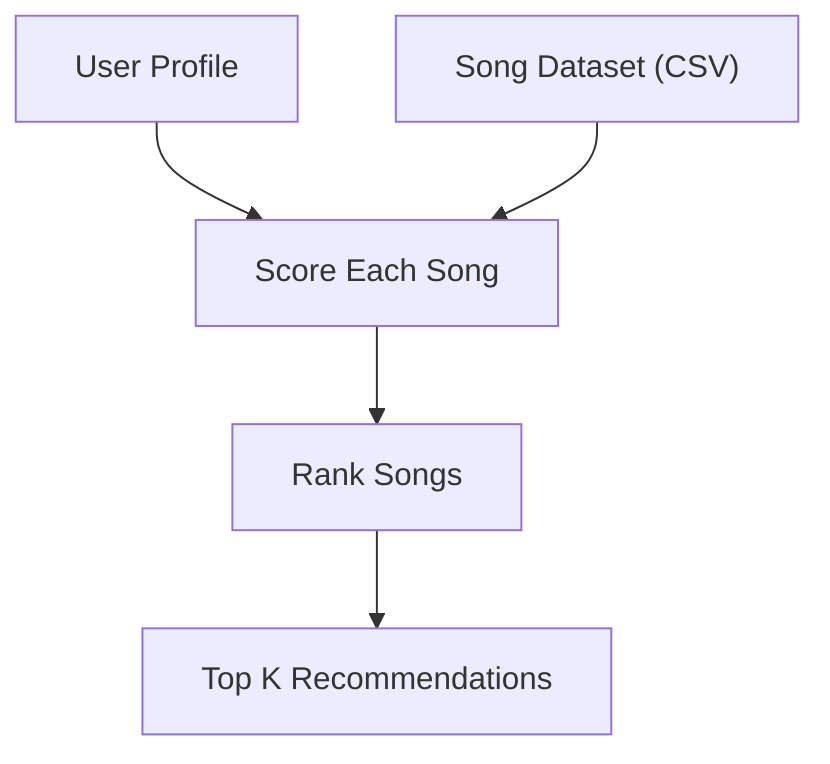
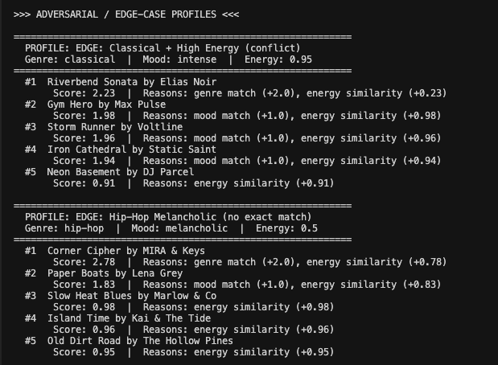

# 🎵 Music Recommender Simulation

## Project Summary

In this project you will build and explain a small music recommender system.

Your goal is to:

- Represent songs and a user "taste profile" as data
- Design a scoring rule that turns that data into recommendations
- Evaluate what your system gets right and wrong
- Reflect on how this mirrors real world AI recommenders

This version implements a **content-based** recommender that scores each song in a 19-song catalog against a user taste profile using genre match, mood match, and energy similarity. It was evaluated against five user profiles (including two adversarial edge cases) and a weight-shift experiment to test how sensitive the rankings are to a single tuning decision.

---

## How The System Works

Real-world music apps often blend several ideas. **Collaborative filtering** learns from what many users play, skip, or like—*people who liked X also liked Y*—without needing to know why a song “fits.” **Content-based** methods look at the songs themselves: genre, mood, energy, and other tags or audio features, then match them to what this user says they want. This project is **content-based**: each recommendation is driven by how well a song’s **features** align with **your user profile**, not by crowd behavior from millions of listeners.

The simulation **prioritizes** three signals, in order of importance you can tune with weights: **genre** (broad musical category), **mood** (emotional vibe), and **energy similarity** (how close the song’s energy is to the user’s target, not simply “high” or “low” energy). Songs get a **numeric score** from these pieces; the **highest-scoring** songs surface as top recommendations.

### System Flow Diagram



### Example CLI Output

Here’s how the recommender output looks when run in the terminal with a standard profile:


### Song Features Used in Scoring

- **genre** — broad musical category (e.g. pop, lofi, rock)
- **mood** — emotional vibe (e.g. happy, chill, intense)
- **energy** — intensity on a 0.0–1.0 scale

The dataset also stores `tempo_bpm`, `valence`, `danceability`, and `acousticness`, but the current scoring logic does **not** use them.

### User Profile Features

- `favorite_genre`
- `favorite_mood`
- `target_energy` (0.0–1.0)

### Scoring Recipe

For every song, the recommender:

1. Adds **2.0 points** if the song's genre matches the user's `favorite_genre`.
2. Adds **1.0 point** if the song's mood matches the user's `favorite_mood`.
3. Adds an **energy similarity** score: `max(0, 1.0 − |song_energy − target_energy|)`. The closer the song's energy is to the target, the higher this score (up to 1.0).

The three components are summed into a **total score**. All songs are ranked highest-to-lowest, and the top *k* (default 5) are returned as recommendations.

### User Profiles Tested

The system was evaluated against **five profiles** defined in `src/main.py` — three standard archetypes and two adversarial edge cases.

**Standard profiles:**

| Profile | Genre | Mood | Energy |
|---------|-------|------|--------|
| High-Energy Pop | pop | happy | 0.85 |
| Chill Lofi | lofi | chill | 0.38 |
| Deep Intense Rock | rock | intense | 0.90 |

Here’s an example of the stress test output using the three standard user profiles:


**Adversarial / edge-case profiles:**

| Profile | Genre | Mood | Energy | Purpose |
|---------|-------|------|--------|---------|
| EDGE: Classical + High Energy (conflict) | classical | intense | 0.95 | Genre and energy conflict — the only classical song has very low energy |
| EDGE: Hip-Hop Melancholic (no exact match) | hip-hop | melancholic | 0.50 | No song in the catalog matches both hip-hop and melancholic |

These edge-case profiles were used to expose system weaknesses:



The **High-Energy Pop** profile is a good example of how the three features work together. Genre (`"pop"`) anchors the listener's broad taste, mood (`"happy"`) narrows to feel-good tracks, and energy (`0.85`) pins the intensity level. A chill lofi track like "Library Rain" (energy 0.35) mismatches on all three dimensions, while an intense rock track like "Storm Runner" (energy 0.91) is close in energy but fails on genre and mood — so the scoring clearly separates the user's preferred vibe from very different listening styles.

---

## Getting Started

### Setup

1. Create a virtual environment (optional but recommended):

   ```bash
   python -m venv .venv
   source .venv/bin/activate      # Mac or Linux
   .venv\Scripts\activate         # Windows
   ```

2. Install dependencies

```bash
pip install -r requirements.txt
```

3. Run the app:

```bash
python -m src.main
```

### Running Tests

Run the starter tests with:

```bash
pytest
```

You can add more tests in `tests/test_recommender.py`.

---

## Experiments

### Multi-Profile Stress Test

All five user profiles (three standard, two adversarial) were run against the full 19-song catalog. Standard profiles produced intuitive results — the pop listener got pop songs at the top, the lofi listener got lofi songs. The adversarial profiles revealed weaknesses:

- **EDGE: Classical + High Energy (conflict):** The only classical song (Riverbend Sonata, energy 0.18) still ranked first despite a 0.77 energy gap, because the genre bonus alone (2.0 pts) overwhelmed everything else.
- **EDGE: Hip-Hop Melancholic (no exact match):** No song matches both hip-hop and melancholic, so the system fell back to partial matches. The lone hip-hop track ranked first on genre alone, even though a folk or blues song might have been a better emotional fit.

### Weight-Shift Experiment (Genre ↓, Energy ↑)

To test whether genre was over-weighted, the scoring constants were changed from the baseline (`genre=2.0, mood=1.0, energy=1.0`) to an experimental set (`genre=1.0, mood=1.0, energy=2.0`).

**What changed:**

- For the Classical + High Energy profile, high-energy songs from other genres (metal, house) rose above the low-energy classical track — a more sensible result given the user's energy target.
- For the Chill Lofi profile, ambient and folk songs began appearing alongside lofi tracks, suggesting energy similarity is a strong cross-genre signal that the baseline weights undervalued.
- Standard profiles still produced reasonable results, though genre-matching songs sometimes dropped a rank or two when their energy was not a close fit.

The experiment confirmed that a single weight choice can silently dominate the entire ranking when the dataset is small.

*Add screenshot here showing the top-5 recommendations after the weight-shift experiment.*

---

## Limitations and Risks

- **Tiny catalog (19 songs):** Many genre/mood combinations have zero or one representative, so the system often can't diversify within a genre.
- **Genre over-weighting:** At the baseline weights (genre = 2.0), a genre match almost always lands a song in the top 5, even when its energy or mood is a poor fit.
- **Binary mood matching:** "happy" and "euphoric" are treated as completely different strings, even though they are emotionally similar. There is no fuzzy or semantic matching.
- **Unused features:** The dataset includes tempo, valence, danceability, and acousticness, but the scoring ignores them entirely — users who care about those qualities get no benefit.
- **No personalization over time:** The system has no memory; it cannot learn from what a user skips or replays.

See the [Model Card](model_card.md) for a deeper discussion of biases and fairness risks.

---

## Reflection

[**Model Card (full personal reflection)**](model_card.md#personal-reflection)

[**Technical evaluation notes**](reflection.md) — profile-by-profile comparisons and takeaways from testing.

In short: this project is **content-based** scoring (genre, mood, energy) over a tiny catalog. Simple rules can look smart until an edge profile or a weight change exposes how fragile the rankings are. The weight-shift experiment and the adversarial profiles were the most useful checks because they showed *when* to trust the list and *when* not to.

