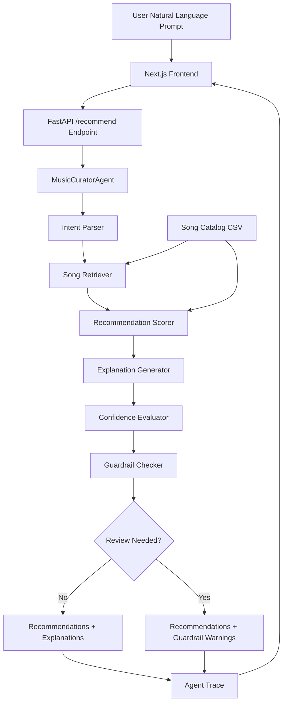

# VibeMatch AI

VibeMatch AI is a full-stack, local music recommendation app that turns a natural-language listening prompt into ranked song suggestions with explanations, confidence, guardrails, and an agent trace. It matters because recommenders can feel like black boxes; this project makes each step visible so a reviewer can see how user intent becomes a playlist.

## Demo Video

<div style="position: relative; padding-bottom: 56.25%; height: 0;"><iframe src="https://www.loom.com/embed/2553e45484f84b21985fcf37587bb33b" frameborder="0" webkitallowfullscreen mozallowfullscreen allowfullscreen style="position: absolute; top: 0; left: 0; width: 100%; height: 100%;"></iframe></div>

## Original Project

The original Modules 1-3 project was **Music Recommender Simulation**, a Python CLI recommender built to explore how simple AI-style recommendation systems work. It represented songs and user taste profiles as structured data, scored a song catalog by genre, mood, and energy similarity, and printed ranked recommendations with reason strings. The project also included stress tests, edge-case profiles, a model card, and reflection notes about bias, fragile scoring rules, and the limits of tiny catalogs.

VibeMatch AI expands that CLI simulation into a portfolio-ready full-stack app while preserving the original scoring logic as the core recommendation engine.

## What It Does

- Accepts prompts like `happy pop workout songs` or `lo-fi study beats to relax`.
- Parses user intent into genre, mood, target energy, acoustic/context cues, and parser warnings.
- Retrieves songs from a local CSV catalog.
- Scores and ranks recommendations using transparent content-based rules.
- Generates plain-English explanations for each recommendation.
- Evaluates confidence and applies guardrails for vague or conflicting prompts.
- Returns raw JSON through a FastAPI endpoint and displays it in a Next.js frontend.

## Architecture Overview

The system is split into a **Next.js frontend** and a **FastAPI backend**. The frontend collects the user prompt and sends it to `POST /recommend`. The backend runs a deterministic `MusicCuratorAgent` pipeline: intent parser, song retriever, scorer, explainer, confidence evaluator, and guardrail checker. The response includes recommendations plus trace data so the whole workflow is inspectable.



## Project Structure

```text
applied-ai-system-final/
├── frontend/                 # Next.js App Router UI
├── backend/
│   ├── app/
│   │   ├── main.py           # FastAPI routes
│   │   ├── agent.py          # MusicCuratorAgent orchestration
│   │   ├── recommender.py    # Original scoring logic
│   │   ├── evaluate.py       # Agent evaluation harness
│   │   ├── data/songs.csv    # Local catalog
│   │   └── tools/            # Parser, retriever, scorer, explainer, confidence, guardrails
│   ├── tests/
│   └── requirements.txt
├── assets/                   # Screenshots and architecture assets
├── docs/                     # Model card and reflection
└── README.md
```

## Setup Instructions

### 1. Run The Backend

```bash
cd backend
pip install -r requirements.txt
uvicorn app.main:app --reload
```

The backend runs at `http://localhost:8000`.

Quick health check:

```bash
curl http://localhost:8000/health
```

Expected response:

```json
{ "status": "ok" }
```

### 2. Run The Frontend

Open a second terminal:

```bash
cd frontend
npm install
npm run dev
```

Open `http://localhost:3000`, enter a prompt, and click **Generate playlist**. The app displays the backend JSON response directly.

### 3. Run Tests And Evaluation

```bash
cd backend
python3 -m pytest
python3 -m app.evaluate
python3 -m app.cli
```

`app.evaluate` runs predefined agent prompts and checks recommendations, confidence, guardrails, and trace completeness.

## Sample Interactions

### Example 1: Strong Match

Input:

```text
happy pop workout songs
```

Selected output:

```json
{
  "intent": {
    "favorite_genre": "pop",
    "favorite_mood": "happy",
    "target_energy": 0.85,
    "matched_terms": ["pop", "happy", "workout"]
  },
  "recommendations": [
    {
      "rank": 1,
      "song": {
        "title": "Sunrise City",
        "artist": "Neon Echo"
      },
      "score": 3.97,
      "explanation": "Recommended because Sunrise City by Neon Echo lines up with the pop genre cue, the happy mood cue, your target energy."
    }
  ],
  "confidence": {
    "label": "high",
    "score": 0.8
  },
  "guardrails": {
    "safe": true,
    "requires_human_review": false,
    "warnings": []
  }
}
```

### Example 2: Synonym And Context Parsing

Input:

```text
lo-fi study beats to relax
```

Selected output:

```json
{
  "intent": {
    "favorite_genre": "lofi",
    "favorite_mood": "chill",
    "target_energy": 0.35,
    "matched_terms": ["study beats", "relax", "study"]
  },
  "recommendations": [
    {
      "rank": 1,
      "song": {
        "title": "Library Rain",
        "artist": "Paper Lanterns"
      },
      "score": 3.97
    }
  ],
  "confidence": {
    "label": "high",
    "score": 0.81
  }
}
```

### Example 3: Vague Prompt With Guardrails

Input:

```text
playlist please
```

Selected output:

```json
{
  "intent": {
    "favorite_genre": "",
    "favorite_mood": "",
    "target_energy": 0.6,
    "matched_terms": [],
    "warnings": [
      "No supported genre was detected; scoring across the full catalog.",
      "No supported mood was detected; using energy and any genre cues available.",
      "No catalog-backed prompt terms were detected; returning broad recommendations."
    ]
  },
  "recommendations": [
    {
      "rank": 1,
      "song": {
        "title": "Adore You",
        "artist": "Harry Styles"
      }
    }
  ],
  "confidence": {
    "label": "low",
    "score": 0.14
  },
  "guardrails": {
    "safe": true,
    "requires_human_review": true
  }
}
```

## Design Decisions

- **Deterministic local agent:** I avoided external LLM calls so the project is easy to run, test, and review without API keys or hidden costs.
- **Transparent scoring:** The original scoring model is intentionally simple: genre match, mood match, and energy similarity. This makes the output explainable, but it also means the system cannot understand subtle emotional similarity unless I explicitly encode it.
- **Agent pipeline instead of one large function:** I split parsing, retrieval, scoring, explanation, confidence, and guardrails into separate tools so each step can be tested and improved independently.
- **Raw JSON frontend output:** The frontend currently displays the backend response directly. That keeps the focus on backend correctness and makes it easy for reviewers to inspect the agent’s reasoning.
- **No database/auth/Docker:** The goal is a clean local portfolio project, not production infrastructure.

## Stretch Features (For Grading)

- **Agentic Workflow Enhancement (implemented):** The backend uses a multi-step `MusicCuratorAgent` chain with observable intermediate steps: `intent_parser -> retriever -> scorer -> explainer -> confidence -> guardrails`. Each response includes a `trace` field so graders can verify decision-making and step status directly.
- **Test Harness / Evaluation Script (implemented):** `python3 -m app.evaluate` runs predefined prompts and prints a pass/fail summary with confidence labels/scores, guardrail review flags, and top-song checks. Current run result: **8/8 evaluation cases passed**.

## Testing Summary

The backend test suite covers the original recommender, the agent workflow, guardrails, confidence scoring, the FastAPI endpoint, and the evaluation harness.

Verified commands:

```bash
cd backend
python3 -m pytest
python3 -m app.evaluate
python3 -m app.cli
```

What worked:

- Strong prompts like `happy pop workout songs` produce high-confidence recommendations.
- Synonyms like `lo-fi` and `study beats` map into catalog-backed intent.
- Vague prompts still return recommendations but trigger low confidence and review warnings.
- Conflicting prompts produce guardrail warnings without breaking the app.
- The agent trace consistently includes parser, retriever, scorer, explainer, confidence, and guardrail steps.

What did not work perfectly:

- Exact string matching is still limited. Related moods like `happy`, `uplifting`, and `euphoric` are treated separately unless explicitly mapped.
- The system can recommend a technically high-scoring song even when a human might prefer more diversity or nuance.
- Confidence is heuristic, not learned from real user feedback.

What I learned:

- Small scoring choices can dominate recommendation behavior.
- Guardrails are useful even in a simple local app because they make uncertainty visible.
- Evaluation prompts are a practical way to catch regressions in agent behavior before adding more complexity.

## 4. Reliability And Evaluation

- Automated tests: `python3 -m pytest -q` -> **21/21 tests passed**.
- Evaluation harness: `python3 -m app.evaluate` -> **8/8 evaluation cases passed**.
- Confidence scoring: confidence is returned for every response (`low`/`medium`/`high`) with a numeric score in `[0.0, 1.0]`. In the current 8-case harness run, average confidence was **0.54**.
- Logging and error handling: `POST /recommend` logs invalid and unexpected failures, returns `400` for invalid user input, and returns `500` for unexpected server-side errors.
- Human evaluation: profile-by-profile review and edge-case analysis are documented in [`docs/reflection.md`](docs/reflection.md).

Short reliability summary:

> 21/21 automated tests passed and 8/8 evaluation cases passed. Confidence scores averaged 0.54 across mixed easy and vague prompts. Reliability improved after adding guardrails, confidence thresholds, and explicit input/error handling.

## Reflection

This project taught me that AI systems are not just about producing an answer; they are about designing the path to that answer. The original recommender showed how a few features and weights can create results that feel intelligent, but also how quickly edge cases expose hidden assumptions.

Building VibeMatch AI pushed me to think more like a product engineer: preserve working logic, separate concerns, add tests around behavior, and make uncertainty visible to users. The most valuable lesson was that explainability is not an afterthought. If the system can show its intent, confidence, guardrails, and trace, it becomes easier to debug, improve, and trust.

## 5. Reflection And Ethics

- Limitations and bias: the recommender still relies on exact string matching for genre/mood, so under-represented moods and sparse genre intersections can produce simplistic outputs.
- Misuse risk: users could over-trust recommendations for sensitive contexts (mental health, safety, or identity-sensitive curation). Mitigation includes confidence labels, guardrail warnings, and `requires_human_review` on low-confidence prompts.
- Reliability surprise: tiny tuning changes to scoring weights can reorder top results significantly, especially on edge prompts.
- AI collaboration (helpful): using a staged pipeline (parser -> retriever -> scorer -> explainer -> confidence -> guardrails) made testing and debugging much clearer.
- AI collaboration (flawed): one generated draft overemphasized genre and produced brittle rankings on contradictory prompts; this was corrected through edge-case testing and guardrail checks.

## Supporting Docs

- [Model Card](docs/model_card.md)
- [Technical Reflection](docs/reflection.md)
- [CLI Output Screenshot](assets/cli-output.png)
- [Standard Profile Stress Test](assets/stress-test_standard-profile.png)
- [Edge Profile Stress Test](assets/stress-test_edge-profile.png)
